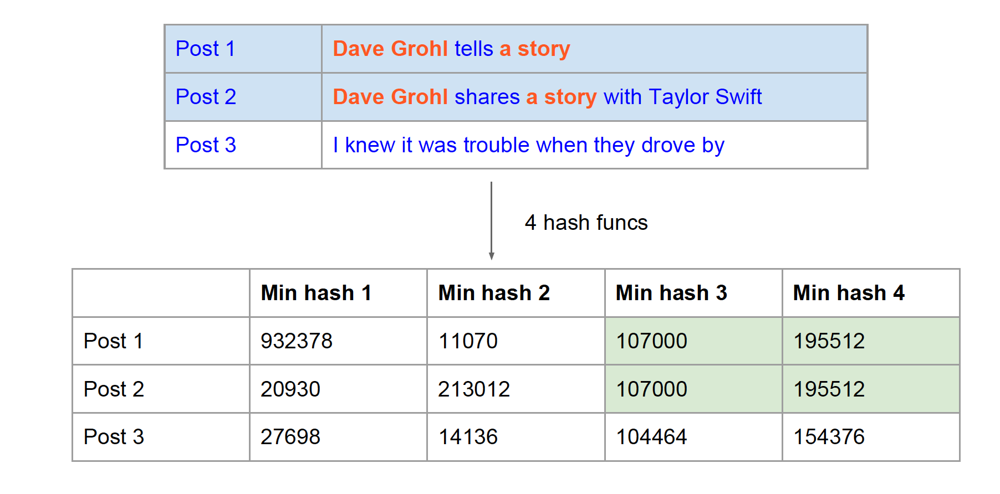
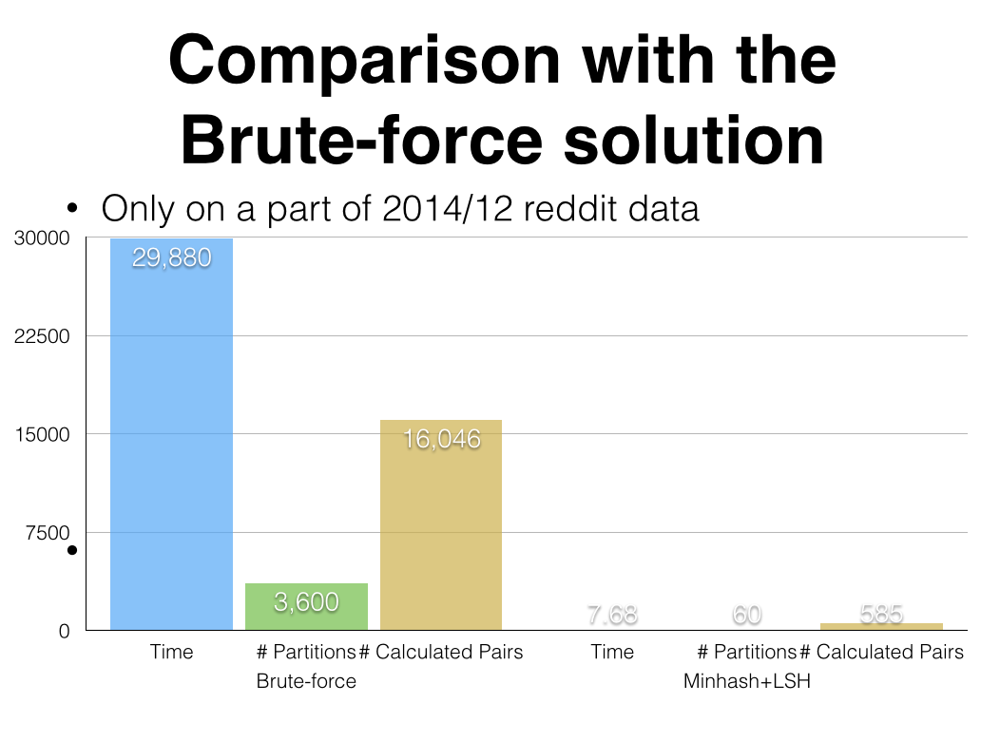
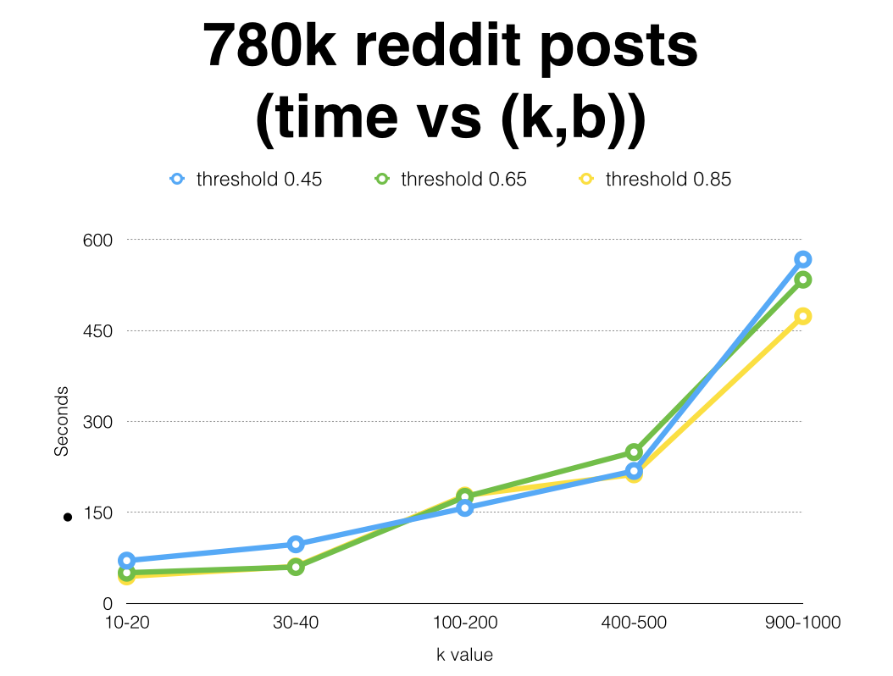

# Benchmark MinHash+LSH algorithm on Spark
* Insight Data Engineering Fellow Project

## Motivation: Explore approximate neighbor algorithms

This project is motivated by speeding up neighbor searching for recommendation/classification algorithms. Even for the most straightforward algorithm, KNN, the naive brute-force implementation takes O(n^2)*O(similarity calculation). In the graduate school, I learned to implement LSH + Random Projection approach to speed up KNN with cosine similarity. For this project, I'm exploring another variant of LSH algorithm: MinHash + LSH for speeding up neighbor search wrt Jaccard Similarity ("Mining massive datasets", Rajaraman and Leskovec). Jaccard Similarity is really useful for finding similar documents (e.g. plagirism) and sequences. I'm interested in implementing and benchmarking this algorithm in both batch and real-time mode on the distirbuted system (Spark, Kafka and Redis).

## MinHash + LSH Implementation

First of all, let's define our task is to recommend posts based on Jaccard Similarity of texts. Now suppose we have three posts in the pool. It's quite obvious to see first two posts are almost the same. MinHash algorithm basically applies k hash functions on the list of tokens and calculate the min value for each function. Now we converted the tokens into the following hash value table:

However, still some work to be done. The time complexity is now O(kN) for pairwise lookups. In order to further reduce the search space, LSH is introduced to divide the hash value table into b bands and r rows (each band combines r rows). Then re-hash and generate the following table:

There're few nice things about this approach: 1. it effectively reduces the search space utilizing the collision property of Hashing. Now the buckets become (band id, band hash). If two posts have the same chunks, they should be hashed to the same bucket. 2. It provides an estimated threshold (lowerbound) for similarity measures of items in the same group. The threshold is approximately (1/b)^(1/r). By changing band width (r) and number of bands (b), we can adjust the similarity lowerbound in order to filter out irrelevant pairs. It will be extremely useful for finding top K similar items. This feature is evaluated later in the Evaluation section.

## Pipeline

The pipeline is designed for both batch and real-time benchmark of MinHash+LSH algorithm. The data are reddit posts in 12/2014 (for batch) and 1/2015 (for real-time). They're preprocessed (tokenize & remove stopwords) and stored in S3. For the batch processing, data flows from S3 into Spark for batch version of the algorithm (MapReduce) and brute-force method (join). Then the calculated results (e.g. band id and groupings, post information) are stored in Redis database, a key-value store for fast lookups and writes. For the real-time part, kafka sends data at different rates (to mimic new posts) to Spark streaming. Then the iterative, online version of the algorithm is running on Spark Streaming and it updates and looks up data from Redis.

## Evaluation
Batch:

Streaming:

## Limitations & Conclusion

